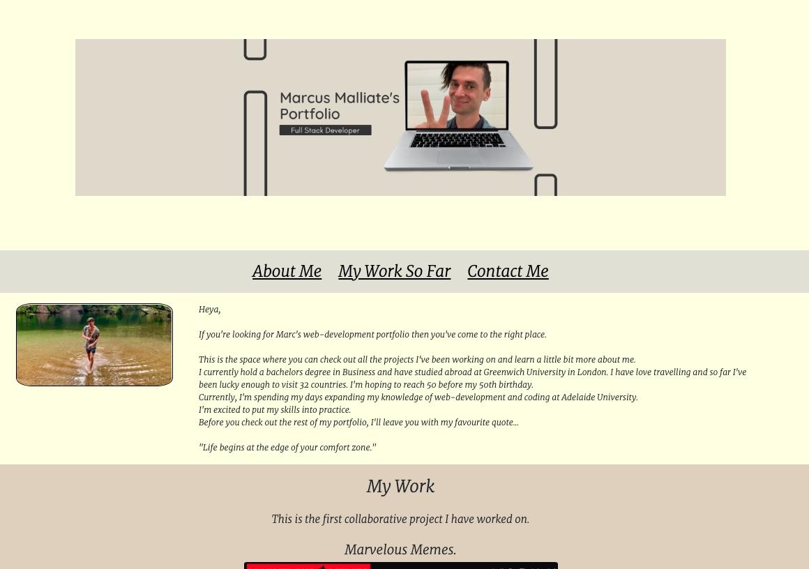
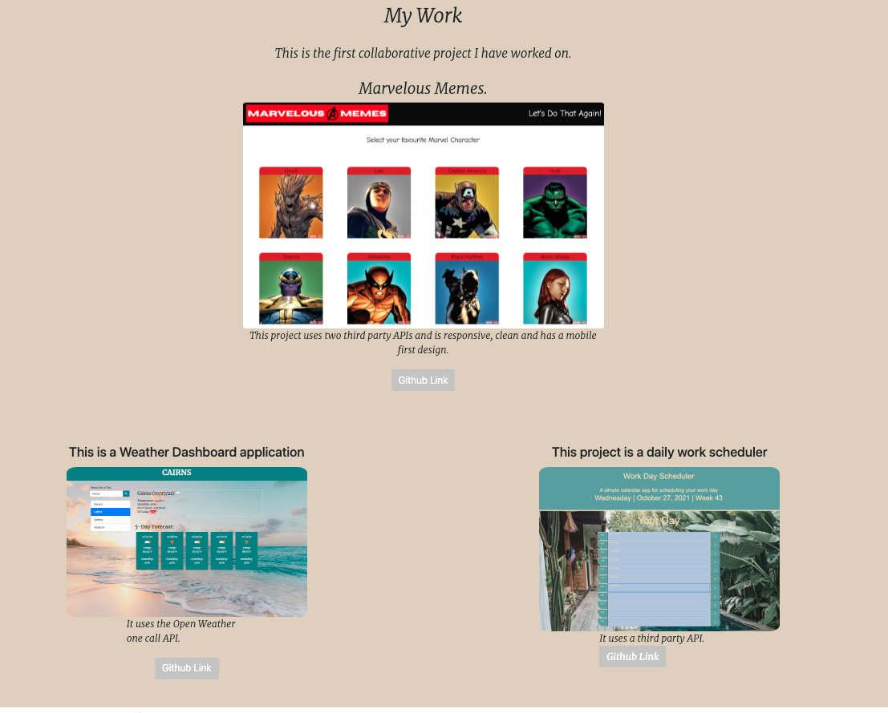

# Marc Malliate's Portfolio

## About this Assignment
This website will showcase my work that I produce over the duration of this course.  This webpage will improve as my skills and knowledge grows.

So far it has the following features:
1. My new, a recent photo of me and links to sections about me, my work and my contact details.
2. A responsive layout.
3. Meets all the acceptance criteria layout out in my home work assignment.

The website has been deployed at the live URL: https://marcmalliate.github.io/My-Portfolio/

The github repository contains application code, has a unique name and follow best practice as well as multiple descriptive commit messages.

### Screenshots:

© 2021 Marc Malliate